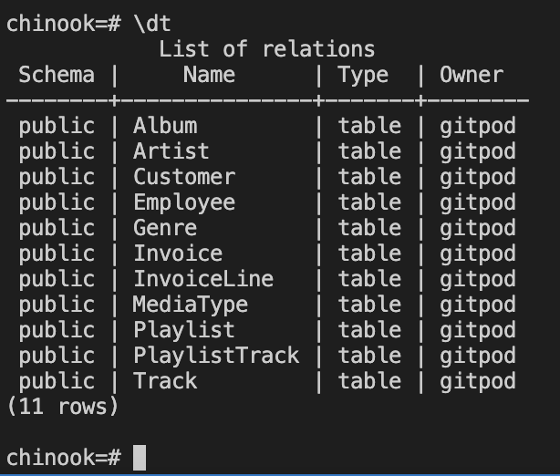

Welcome zemaciel,

This is the Code Institute student template for Gitpod. We have preinstalled all of the tools you need to get started. It's perfectly ok to use this template as the basis for your project submissions.

You can safely delete this README.md file, or change it for your own project. Please do read it at least once, though! It contains some important information about Gitpod and the extensions we use. Some of this information has been updated since the video content was created. The last update to this file was: **September 1, 2021**

# Database Management

    !(Use GitPod)[readme/git.jpg]


## **What is PostgreSQL?**

**What is it?**
A free, open source relational database management system.
**What does it do?**
Postgres has powerful features and acts as a primary database for many web and mobile applications.
**How do you use it?**
The Postgres server runs as a service on most operating systems, and can be used from the command line, through graphical clients, or directly from your own applications.

# Important!

## Error fix due to Gitpod change

**If you get the following error after typing `psql` in the terminal:**

**`psql: error: could not connect to server: No such file or directory`**

**Please use the following command in the terminal to set an environment variable needed for it to work:**

**`set_pg`**

**And then try the `psql` command again**

**You will need to do this each time you return to your Gitpod workspace for the Database Management Systems videos.**

## **PostgreSQL**

If you recall from our previous lessons, when working with data, you can choose between
relational and non-relational databases.
However, going a bit deeper into **relational databases**, Postgres is an object-relational
database, whereas MySQL is purely a standard relational database.

### **PostgreSQL**

- Object Relational Database
- Case-sensitive
- Natively supports multiple programming languages, including Python and JavaScript

### MySQL

- Standard Relational Database
- Not case-sensitive
- Limited support with other programming languages

## The learning outcomes for the following lessons will include:

- Learning how to use Postgres in its native form through the command-line interface.
- Using helpful Python adapters to perform those same queries.
- And finally, how to execute our queries programmatically from within our Python files.
- End of transcript. Skip to the start.

## Installing the Chinook database

What is it?
A series of SQL commands in a text file.
What does it do?
Allows us to script database operations, such as creating, populating, and updating databases.
How do you use it?
Put database commands in a .sql file, and run them using the Postgres command line interface.

**Extra Links:**

[Code Institute Gitpod Template](https://github.com/code-institute-org/gitpod-full-template) (**Important:** You must use this Gitpod Template to complete this module)[Chinook Database SQL](https://github.com/lerocha/chinook-database/blob/master/ChinookDatabase/DataSources/Chinook_PostgreSql.sql)

```
wget https://raw.githubusercontent.com/lerocha/chinook-database/master/ChinookDatabase/DataSources/Chinook_PostgreSql.sql
```

[Source Code Repo](https://github.com/Code-Institute-Solutions/postgresql-and-python/tree/main/01_installing_the_chinook_database)

[****COMMANDS.md****](https://www.notion.so/COMMANDS-md-bd786dbd3e094c929407268a570699c4)

1. Create a new repository and used the following code on the terminal to get the sample data base:  `wget https://raw.githubusercontent.com/lerocha/chinook-database/master/ChinookDatabase/DataSources/Chinook_PostgreSql.sql`
2. A new file called `Chinook_PostgreSql.sql` is created.
3. Next, we need to start the Postgres command-line interface, or shell, in order to get the Chinook database installed, and the data populated. To launch the Postgres CLI, we can simply type "`psql`" and hit enter.
4. To view, or list any database in our enviromenment type `\l`  (backslash+L)
    
    
    
5. By default PostgreSQL has three databases out-of-the-box:
`postgres
template0
template1`
6. **Create a new database** Instead of using any of these default databases, let's create a new database for our Chinook lessons. `CREATE DATABASE chinook;` **Don't forget the semicolon at the end of the command.**
7. To change between databases use `\c databasename`
example: `\c postgres` 
`\c chinook`
8. The `\c` (*backslash C stands)* for **connect**, telling to which database you want to connect. 
9. Finally, while we're connected to our new chinook database, we need to **initialise** or
**install** the downloaded sample Chinook PostgreSQL database.
Type: `\i Chinook_PostgreSql.sql`  (CASE SENSITIVE!)
The `\i` generally means include, integrate, **install, or initialise**.
*Essentially, this file is an SQL script that contains all of the instructions needed to
create tables, and populate our database with information so that we have useful data for practice.*


## PostgreSQL from the command line

What is it?
The Postgres server running on a command line terminal
What does it do?
Provides access to Postgres via the command line in an IDE.
How do you use it?
Use the command line to run scripts; create, query, and update databases.


1. After the database is install, you should see the line : `chinook=#`
2. You may Type `\q` to exit or quite the PostGreCLI, simullating a time out or restart. 
3. To start the Database and connect to Chinook database, type: `psql -d chinook`
-d flag is used to specify the database
4. To check if the tables and data were successfully added to the database, type 
`\dt` . This will allow us to display tables on our database.



### A few examples of how to query the data using basic SQL commands.

> It's standard practice to write SQL commands in capital letters 
* asterisk means to select anything and everything
Use double straight quotes (`"`)
Always finish command in semicolon
> 
- Retrieving all data from the Artist table: `SELECT * FROM "Artist";`
- Exit the list: Type `q`.  (Not \q)
- Select Name from Artist:  `SELECT "Name" FROM "Artist";`
- Specify a particular artist name using the **WHERE** clause.
When it comes to the specific value I'd like to search you must use **single-quotes**.
`SELECT * FROM "Artis" WHERE "Name" = 'Queen';` 
If the value is a primary key and integer, we don't need the single-quotes, but it will
still work if you include them: `SELECT * FROM "Artist" WHERE "ArtistId" = 51;`


# Installing the libraries & setting up

WHAT IS IT?
A Python package and data adapter called psycopg2.
WHAT DOES IT DO?
Run Postgres commands from Python code, instead of the CLI.
HOW DO YOU USE IT?
Use the psycopg2 library and it's inbuilt methods.

## psycopg2

- Data Base Adapter
- Connects Python to Postgres
- Install it by typing pip3 install psycopg2

Once that's installed, we're going to use its built-in API to access our Chinook database,
and we'll do that by using a Python file, not the CLI this time.
Let's create a new Python file using the "touch" command, and call it '[sql-psycopg2.py](http://sql-psycopg2.py/)', then
open it up for editing.

```html
touch sql-psycopg2.py
```

### Editing the new file sql-psycopg2.py

- DO NOT call your file [psycopg2.py](http://psycopg2.py/), as this is a default file already used by the package
- The very first thing that we need to do , is to 'import psycopg2' at the top of our file.
- Then, we need to have psycopg2 **connect** to our Postgres database called Chinook, using
the .**connect() method**, and we'll assign that to a variable of '**connection**'.
- We are only specifying the name of our database, "chinook", in double-quotes, but you could
include additional connection values such as host, username, password, and so on.
- Next, our connection needs an instance of a **Cursor Object.**
A cursor object is another way of saying a 'set' or 'list', similar to an 'array' in JavaScript.
Essentially, anything that we query from the database will become part of this cursor object,
and to read that data, we should iterate over the cursor using a for-loop, as an example.
- Before we start to query the database, we need to set up a way for our data to be retrieved,
or fetched, from the cursor.
I'm going to assign this to a variable of '**results**' since it'll fetch any result that gets queried.
Please note, if we need to query multiple records from our database, we should use the
.`fetchall()` method.
Otherwise, if we're intentionally looking for one particular record, we could use the
`.fetchone()` method.
- Next, once our results have been fetched, we need to end the connection to the database,
so the connection isn't always persistent.
As previously mentioned, our data sits within a cursor object, similar to an array, so in order to retrieve each record individually, we need to iterate over the results using a for-loop.
For each individual result in the results list, print the result.
- Now that we have our Python file setup, we can start to query the Chinook database to retrieve data.
- **Query #1** is to simply select all records from the "Artist" table.
- PsycoPG2 commands are actually quite similar to native SQL commands, with one little twist;
the precise use of quotations. It's extremely important to note that we absolutely must use single-quotes to wrap our query, and double-quotes to specify particular values.

Note that the sintex for queries is different than the CLI: 

```python
cursor.execute('SELECT * FROM "Artist"')
```

Run file:

```python
python3 **sql-psycopg2.py**
```


# Running basic queries (SQLAlchemy)

WHAT IS IT?
SQLAlchemy's middle abstraction layer, the Expression Language.
WHAT DOES IT DO?
Simplifies queries to the database using tables.
HOW DO YOU USE IT?
Connect Python and the SQLAlchemy library to the database, using cleaner code.

INSTALL : **`pip3 install sqlalchemy==1.4.46`**

- Create a new file called [sql-expression.py](http://sql-expression.py) `touch sql-expression.py`
- Import componentes:

```python
from sqlalchemy import (
    create_engine, Table, Column, Float, ForeignKey, Integer, String, MetaData
)
```

- **Link** python file to chinook database:

```python
# executing the instructions from our localhost "chinook" db
db = create_engine("postgresql:///chinook")
```

The three slashes signifies that our database is hosted locally within our workspace environment. 

- After our engine is created, and connected to our database, we need to use the MetaData
class, which we can save to a variable name of 'meta'. The MetaData class will contain a collection of our table objects, and the associated data within those objects.

```python
meta = MetaData(db)
```

The MetaData class will contain a collection of our table objects, and the associated data within those objects.

- **Connect** to the database, using the .connect() method, and the Python with-statement

```python
# making the connection
with db.connect() as connection:
```

Before we start to query the database, we need to construct our tables, so that Python
knows the schema that we're working with. Sometimes you'll hear this referred to as data models, 

### Tables

For the purposes of this video, we will continue with tradition, and perform the **same six queries** from Chinook that we've done previously.
Our first table class, or model, will be for the Artist table, which I'll assign to the variable of 'artist_table'.
Using the **Table import, we need to specify the name of our table, and provide the meta schema.**

```python
# create variable for "Artist" table
artist_table = Table(
    "Artist", meta,
    Column("ArtistId", Integer, primary_key=True),
    Column("Name", String)
)

# create variable for "Album" table
album_table = Table(
    "Album", meta,
    Column("AlbumId", Integer, primary_key=True),
    Column("Title", String),
    Column("ArtistId", Integer, ForeignKey("artist_table.ArtistId"))
)

# create variable for "Track" table
track_table = Table(
    "Track", meta,
    Column("TrackId", Integer, primary_key=True),
    Column("Name", String),
    Column("AlbumId", Integer, ForeignKey("album_table.AlbumId")),
    Column("MediaTypeId", Integer, primary_key=False),
    Column("GenreId", Integer, primary_key=False),
    Column("Composer", String),
    Column("Milliseconds", Integer),
    Column("Bytes", Integer),
    Column("UnitPrice", Float)
)
```
